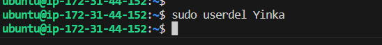

# Introduction to basic Linux commands

## File Manipulation

### sudo command

'sudo apt upgrade'

Y

### pwd command

To show the current/working directory

'pwd'

### cd command

'cd'

To navigate through the directories (change or move from one directory to the other)

### ls command

'ls'

To list files and directories within a system

'ls -r'

To list all files in a subdirectories

'ls -a'

To list all files including the hidden files

'ls -lh'

To show the file sizes in easily readable formats such as MB, GB and TB

### cat command

'cat'

To read data from the file and give its content as output

### cp command

'cp'

To copy files or directories and thier contents

'cp -R'

To copy entire directory

### mv command

'mv'

To move and rename files and directories

### mkdir command

'mkdir'

To create one or multiple directories at once and set permission for each of them

## rmdir command

'rmdir'

To permanently delete an empty directory

### rm command

'rm'

To delete files within a directory

### touch command

'touch'

To create a file named sqlite in the my-portfolio directory

### locate command

'locate'

To find a file in a database system

### find command

'find'

### df command

'df'

To report the system's disk space

### du command

'du'

to check how much space a file or a directory takes up

### head command

'head'

To view the first ten lines of index.html file

### tail command

'tail'

To view/display last ten lines of index.html file

### diff command

'diff'

To compare the contect of index.html and README.md

### ping command

'ping'

To check if google is reachable, ping can also be used to check if a server is reachable

### wget command

'wget'

To download wordpress from the internet

### uname command

'uname'

To print detail information about Linux system and hardware

### top command

'top'

Display all running process and dynamic real time view of the system

### history command

'history'

List previously executed command

### man command

'man'

To view user a manual or utilities that can be run in terminal

### hostname command

'hostname'

Display the system's hostname

'hostname -A'

Display machine's Fully Qualified Domain name 

### useradd usedel command

'useradd'

Create new account

'userdel'

### apt-get command

'apt-get'

To retrieve the information and packages from the authenticated sources for installation, upgrade, and removal of packages along with their dependencies

### nano, vi, jed command

'vi'

Edit file

### htop command

'htop'

To determine the cause of load by each process

