# GIT REPOSITORY

#### Git is a cetral repository used for maintaining and tracking changes to files and directories. It is an essential part of the Git version control system, which facilitates collaborative development and allows several developers to work on a project at once.

## To initialiaze git repository

#### The git init command is what you'll use to start a new repository. Git init is a one-time command you use to start up a new repository for the first time. A new.git subdirectory will be created in your current working directory after you run this command. Additionally, it will produce a new main branch.

'git init'

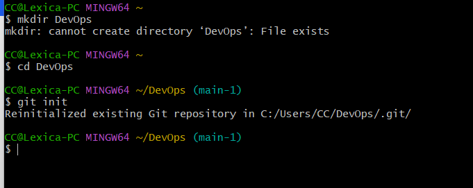

## Making commit

#### Use the git commit command, the -m flag, and your message enclosed in quotes to add a Git commit message to your commit.

### create index.txt file

#### Use the touch command and the file's name to create a new file in the current directory.

'touch index.txt'

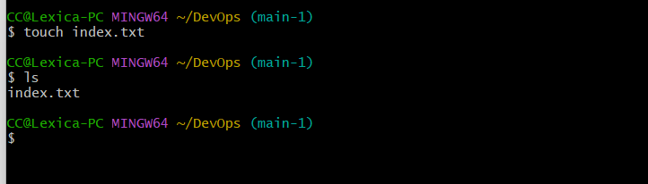

### Add the changes to the git staging area

#### A modification in the working directory is added to the staging area using the git add command. It instructs Git that you want to add updates to a specific file to the upcoming commit.

'git add'

### Commit changes to git

#### Stage the changes with the git add command, followed by the name of the file, before committing them.

'git commit -m "initial commit"#'

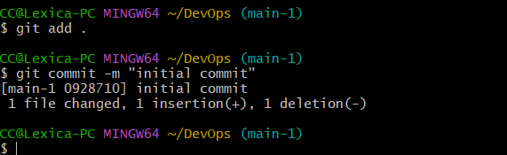

## Making a new Git Branch

#### When you want to start a new feature, you use git branch new-branch to establish a new branch off main. 

'git checkout -b my-new-branch'

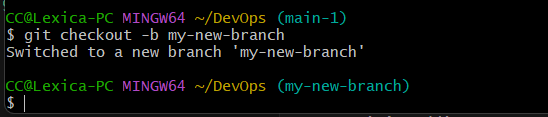

### List git branches

#### Run the git branch command to view local branches, use the git branch -r command to view remote branches and use the git branch -a command to view all local and remote branches.

'git branch'

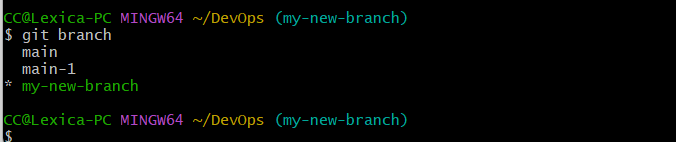

### Change into an old branch

#### You can switch between the branches generated by git branch using the git checkout command. When a branch is checked out, the files in the working directory are updated to match the branch's version, and Git is instructed to keep track of any subsequent commits to that branch.

'git checkout main'

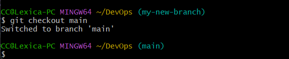

### Merging branches

#### Use git checkout to switch to the branch you want to merge into before merging branches locally. Usually, this branch is the primary branch. The other branch's name should then be specified in this branch using git merge.

'git merge B'

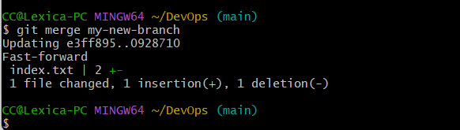

## Create a Github account

#### Go to https://github.com/join, type a user name, your email address, and a password. Choose Sign up for GitHub, and then follow the instructions.

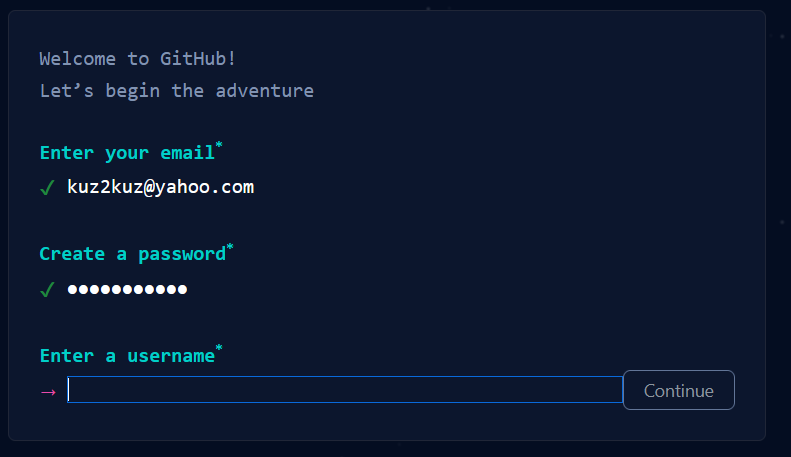

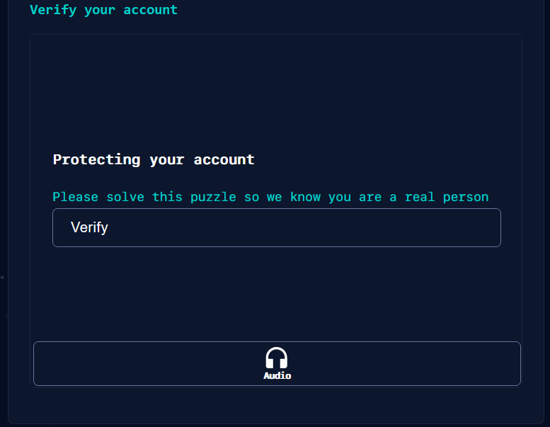

## Creating a new repository

#### In the upper-right corner of github page, use the drop-down menu, and select New repository, type a name for your repository, you may add a description of your repository, choose a repository visibility then select Initialize this repository with a README, then click create repository.

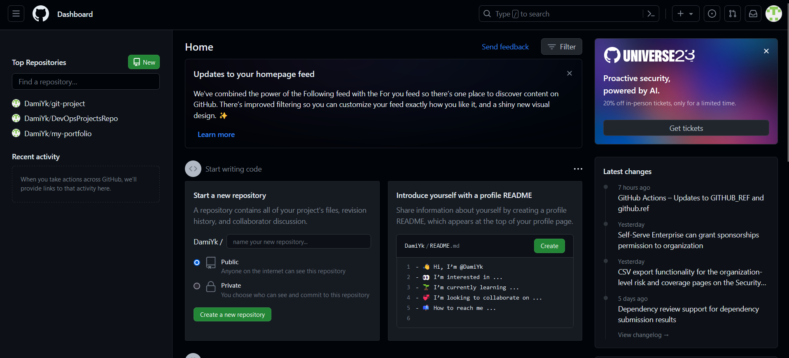

## Push local git repository to remote github repository

#### You must first execute git remote add <url> to add the remote server to Git before you can push the primary repository. Use the command git push origin branch-name> to complete the repository push. 

'git remote add origin –hhttps://github.com/DamiYk/DevOpsProjectsRepo.git'

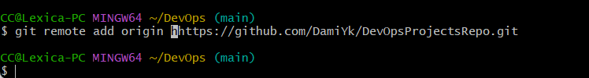

## clone git repository

#### To clone a Git repository, copy the remote URL from your Github repository, then use the Git clone command followed by the remote repository's URL.

'git clone https://github.com/DamiYk/DevOpsProjectsRepo.git'

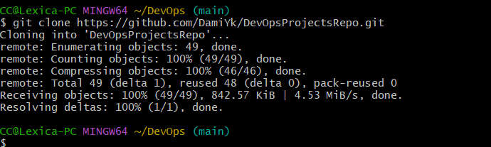

## Branch management and tagging

### Create heading

'# heading 1'

'# heading 2'

'# heading 3'

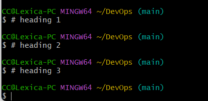

