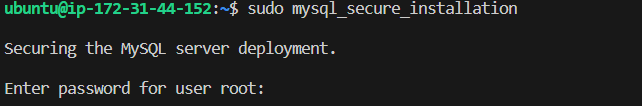
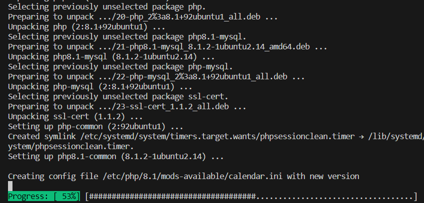

# WEB STACK IMPLEMENTATION (LAMP STACK) IN AWS

#### Developers utilise a LAMP stack, which is a collection of four distinct software tools, to create websites and web applications. LAMP stands for Linux as an operating system, Apache as a web server, MySQL as a database server, and PHP as a programming language.

## Preparing prerequisities

### Create an AWS account and a vitual server with Ubuntu server OS

#### Open the Amazon Web Services home page https://aws.amazon.com/
#### Choose Create an AWS account.
#### Enter your account information, and then choose Verify email address.
#### Enter your verification code, and then choose Verify.
#### Enter a strong password for your root user, confirm it, and then choose Continue.

## Launch an EC2 instance

#### On the EC2 Dashboard, choose Launch instance.

#### Under Name and tags, for Name, enter a name to identify your instance. While the instance name is not mandatory, the name will help you easily identify it.

#### Under Application and OS Images, choose an AMI that meets your web server needs.

#### Under Instance type, for Instance type, select an instance type that meets your web server needs.

#### Under Key pair (login), for Key pair name, choose your key pair.

#### In the Summary panel, review your instance configuration and then choose Launch instance.

<video src="20231006-1730-01.3236797.mp4" controls title="Title"></video>

#### Remember your key pair name (.pem) and the location where where the file saved on your (local machine) computer 

### Connect instance

#### Change directory with command cd to where the downloaded pem file is.

'cd Downloads'

#### Type the SSH command with this structure:

'ssh -i demo-1-key.pem ubuntu@3.81.2.205'

#### ssh: Command to use SSH protocol
#### -i: Flag that specifies an alternate identification file to use for public key authentication.
#### demo-1-key.pem: key pair file
#### ubuntu: Username that uses your instance
#### 3.81.2.205: IP address given to your instance (public IP address)

## Installing Apache and updating firewall

#### Install Apache using Ubuntu's package manager 'apt'

'sudo apt-get update'

### update a list of packages in the package manager

'sudo apt-get install apache2'

### run apache2 package installation

'sudo systemctl status apache2'

### Verify that apache2 is running as a service in the OS

#### For the Web Server to recieve any traffic, the TCP port 80 which is the default port that web browser uses to access the web pages on the internet needs to be opened.

<video src="20231006-1825-04.7011045.mp4" controls title="Title"></video>

'curl http://localhost:80'

'curl http://127.0.0.1:80'

### To access the server locally from the Ubuntu shell, either the IP address 127.0.0.1:80 ot the name 'localhost' can be used in the command.

## Installing MySql

'sudo apt install mysql-server'

### Use 'apt' to acquire and install Mysql

'sudo mysql'

### Log into MySql console and connect to the MySql server as the administrative database user root

'ALTER USER 'root'@'localhost' IDENTIFIED WITH mysql_native_password BY '*********';'

### Run security script to remove some insecure default settings and lockdown access to the database.Set password for the root user using mysql_native_password as default authentication method.

'mysql> exit'

### Exit MySql shell

'sudo mysql_secure_installation'

### To start Interactive Scripting

#### Enter the root user password set above then enter Y to setup 'Validate Password component' or enter any other value to decline 

#### Select Y and then select any preferred level of password validation

#### Select yes for the rest of the questions at each prompt asking whether to change root password, removesome anonymous user, test database, disable remote root logins and reload all the privileges tables to ensure that all changes are effected immediately.

'sudo mysql -p'

#### Log in to the MySql console

## Installing PHP

#### Three module of PHP to be installed are php, php-mysql and libapache2-mod-php

'sudo apt install php libapache2-mod-php php-mysql'

#### Install all module at once witht the above code

#### Confirm PHP version

'php -v'

# Enable PHP on the website

'sudo vim /etc/apache2/mods-enabled/dir.conf'

#### Edit /etc/apache2/mods-enabled/dir.conf file and change the order in which files in the directory index is listed 

#### <IfModule mod_dir.c>
        Change this:
         DirectoryIndex index.html index.cgi index.pl index.php index.xhtml index.htm
         To this:
        DirectoryIndex index.php index.html index.cgi index.pl index.xhtml index.htm
#### </IfModule>

#### Create a new file named index.php inside the custom web root folder

'vim /var/www/projectlamp/index.php'

##### The code to create the index.php file will open like this then the PHP code is added into it.

'<?php'
'phpinfo();'

#### Remove the index.php file
'sudo rm /var/www/projectlamp/index.php'

## Creating Virtual Host for Website using Apache

#### Create a directory named projectlamp

'sudo mkdir /var/www/projectlamp'

#### Assign ownership of directory projectlamp with USER environment variable

'sudo chown -R $USER:$USER /var/www/projectlamp'

#### Creat a new blank configuration file in Apache's sites-available directory

'sudo vi /etc/apache2/sites-available/projectlamp.conf'

#### Edit the file by pressing i, save and quit. Type :wq and press enter to save and quit

#### Show the files in the sites-available directory

'sudo ls /etc/apache2/sites-available'

#### Enable the virtual host

'sudo a2ensite projectlamp'

#### Disable Apache's default website

'sudo a2dissite 000-default'

#### Check for syntax errors in the configuration file

'sudo apache2ctl configtest'

#### Reload Apache foe changes to take effect

'sudo systemctl reload apache2'

#### Create an index.html file in /var/www/projectlamp to test the virtual host is working

'sudo echo 'Hello LAMP from hostname' curl -s http://169.254.169.254/latest/meta-data/public-hostname 'with public IP' curl -s http://169.254.169.254/latest/meta-data/public-ipv4 > /var/www/projectlamp/index.html'

   